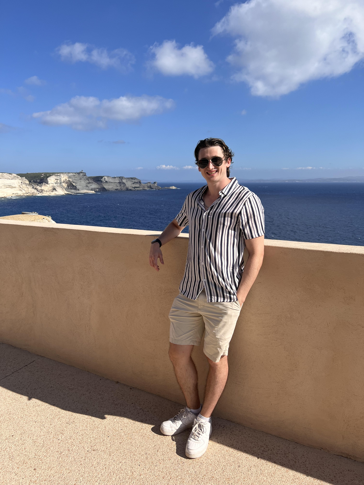
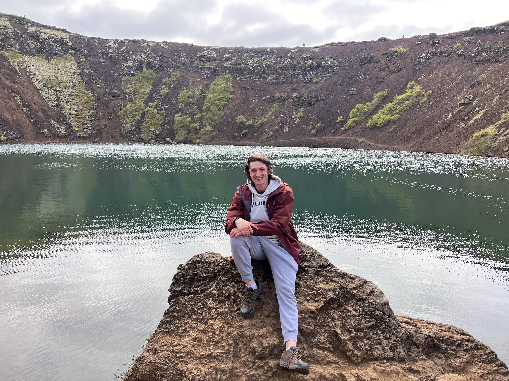
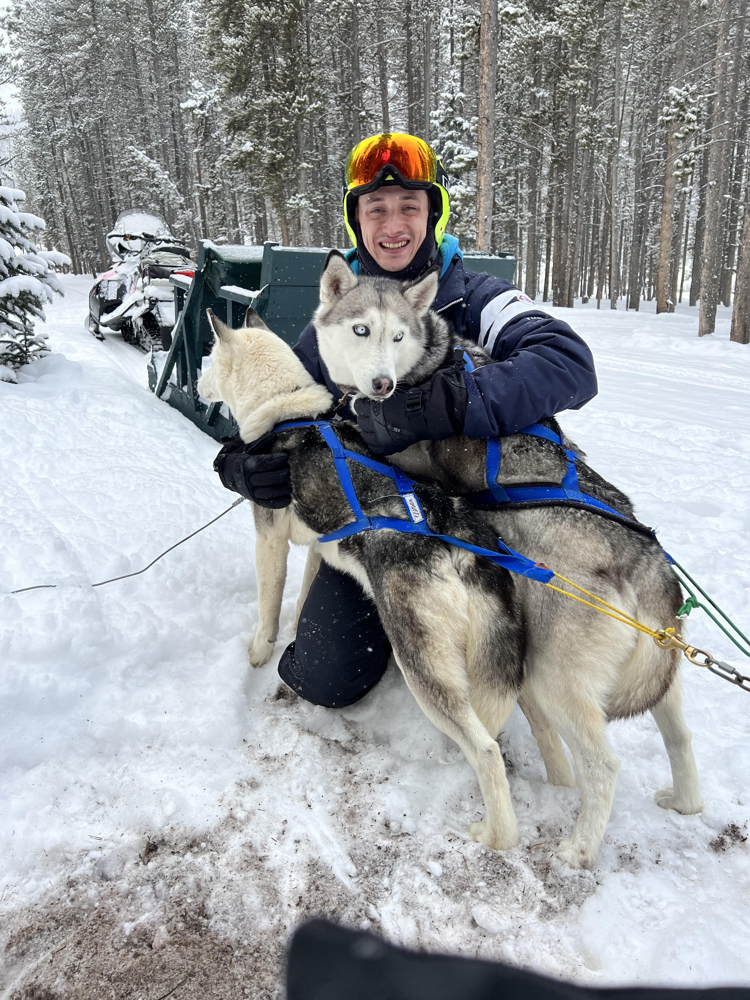

[Home](./)

[Projects](./projects.md)

# About Me

 |  | 

### John "Jack" Theall
#### Boston, MA | Currently located in Binghamton, NY

## Who am I?

I am a software engineer at Collins Aerospace, where I contribute to the design and development of avionics simulation
and computer systems in Binghamton, NY. I am an incredibly driven individual, dedicated to expanding my knowledge of
computing and achieving a level of professionalism that allows me to create various technologies that improve people's lives worldwide.
I am also a skiing fanatic, an amateur musician, and a video game nerd.  

## Why Computer Science?

With technology as powerful as it is in today's world, I believe that an understanding of computer science
is the most powerful tool humans have to create positive change. I, along with the majority of my family,
am a type one diabetic and rely on insulin pump technology daily to survive. Living with this disease
has been eye-opening to the seemingly limitless power of improving technology. I draw motivation from the idea that
in becoming a computing professional, I will have the knowledge and expertise required to similarly improve people's quality of life.

## Hobbies & Interests

#### Skiing
My parents essentially threw me on skis the second I could walk, and I have been in love with the sport ever since.
I have several years of alpine racing experience, and have recently started to experiment with freestyle which has been a blast.
#### Music
Over the course of my life, I have dedicated many years to learning a variety of instruments, including piano, clarinet, 
and most recently, the electric bass. I value having a creative outlet like this, and find that coming home from a long day
to make random bits of music brings me joy and improves my overall mental well-being.
#### Hiking
I love spending time outdoors, and hiking various trails gives me both an excuse to get outside and the chance to explore
places that I might not otherwise discover. It also helps me stay in shape, which is a welcome bonus!
#### Traveling
I have been extremely fortunate in my life to be able to travel to various countries and experience their unique cultures, 
landscapes, and lifestyles. Among my favorite destinations are Iceland and the island of Corsica.
#### The Beach
Growing up in the Greater Boston area, I spent many of my summers on Cape Cod. As a result, I've come to associate the beach
with family, relaxation, and good times. If it's a beach-related activity, I'm there.

 

#### Obligatory Pet Section

This is my bengal cat named Barley. She'll either give you love & cuddles, or claws & teeth depending on her mood. No in-between.

