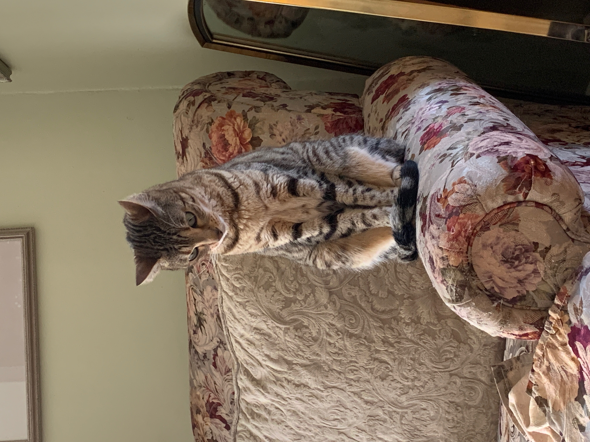

[Home](./)

[Projects](./projects.md)

# About Me

### John "Jack" Theall
#### Boston, MA

## Who am I?

I am a computer science and mathematics undergraduate student studying at Quinnipiac University. I am an incredibly
driven person and I dedicated to learning as much as I can about computing so
that I can achieve a level of professionalism in this field that will allow
me to improve people's lives worldwide. I am expected to graduate with a Bachelor of Science in May 2023.

## Why Computer Science?

With technology as powerful as it is in today's world, I believe that an understanding of computer science
is the most powerful tool humans have to create positive change. I, along with the majority of my family,
am type one diabetic and rely on insulin pump technology daily to survive. Living with this disease
has been eye-opening to the seemingly limitless power of improving technology. I draw motivation from the idea that
once I have become a computing professional, I will have the knowledge and expertise required to perfect the software behind
the artificial pancreas, effectively providing a technological solution to the disease.

## Current Experience

 

#### Infosys Limited

Over the course of the Summer '22, I worked as a software development intern in the InStep Infosys program.
During the program I collaborated with a team of technical mentors, junior software developers, and other InStep interns
to develop a standalone web application designed to accept post-interview feedback from panelists who have interviewed hiring candidates.
Development cycles over the course of the program adhered to agile methodologies. Our standalone app was then integrated into a larger delivery ops web application containing more administrative functionality.

##### Responsibilities

My primary responsibility during the program was to design and build backend entities, repositories, service interfaces & implementations complete with business logic,
and APIs for frontend-backend communication. 

##### Tools Used

I utilized Java Spring Boot to provide me with a backend framework. I also designed entity relations using Postgres and leveraged PostgreSQL and pgAdmin to manage database systems. Finally,
I familiarized myself with the Angular framework to the point of proficiency so that I was able to assist my team in the integration between frontend and backend, and ensure that
API endpoints were hit and results were utilized as intended. 

 

#### Relevant Coursework

My current GPA is 3.95
- Data Structures & Abstraction
- Object Oriented Design
- Intro to Software Development
- Algorithm Design & Analysis
- Computer Architecture & Organization
- Machine Learning in Healthcare
- Operating Systems
- Open-Source Software Development
- Intro to Android Development
- Intro to iOS Development
- Theory of Computation
- Networking and Distributed Processing
- Database Systems
- Embedded Systems & IOT
- Cryptography
- Calculus I
- Calculus II
- Intro to Discrete Mathematics
- Linear Algebra
- Mathematical Modeling

 

#### Skills

##### Application Programming

- Java
- Python
- SQL
- XML
- Proficient in Swift

 

##### Collaboration

- Scrum Master experience
- Team Leadership
- Program Management
- Agile Development
- Git & GitHub Version Control

 

##### Language

- English
- Proficient in French

 

## Non-Academic Interests

- Skiing
- Video editing
- Hiking
- Fishing
- Traveling
- Any beach-related activity
- Improvisational Comedy

 

#### Obligatory Pet Section

This is my bengal cat named Barley. She'll either give you love & cuddles, or claws & teeth depending on her mood. No in-between.

