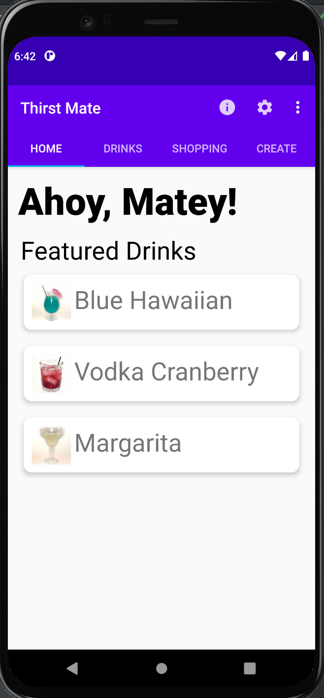
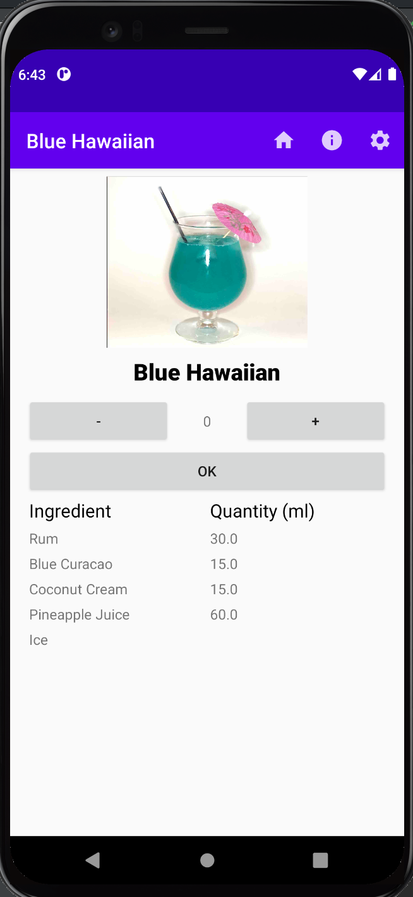
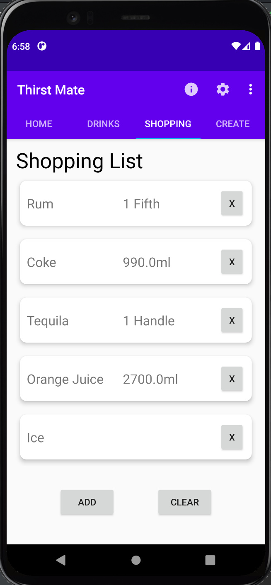

[Home](./)

[About Me](./aboutme.md)

# Projects

This section is dedicated to relevant projects that I have worked on over the course
of my academic career. Links to the GitHub repositories for each project will be included so you can
check them out for yourself.

## Thirst Mate

Home | Drink View | Shopping List
---- | ----- | --------
 |  |  

For my final project for my Android Development class, I collaborated with a partner to design
and develop a fully functional cocktail assistant Android application we titled *Thirst Mate*. 
Nautrally, the app is pirate themed and aims to assist users in planning, shopping for, and creating
any cocktails they would like to make. *Thirst Mate* is designed for users of all experience levels, so whether you're
a mixed drink novice or master level mixologist, this app is for you. *Thirst Mate*'s hallmark feature, the shopping list,
allows users to add specific quantities of drinks to their list which will dynamically update with
ingredients and quantities to make shopping as streamlined and efficient as possible. Finally, *Thirst Mate* also
allows users to enter their own drink recipes, which will be persisted in the app's drinks list.

 

GitHub repo [link here](https://github.com/jjtheall/ThirstMate)

 

## Cat Platformer Game

As part of a semester-long project, I collaborated with a small team of other students
in a series of Scrum sprints to develop, enhance, and maintain a platformer game that
was given to us as a very basic starter library written in Java. I acted as Scrum master in all cycles, which in addition to writing project code
included responsibilities such as creation and oversight of several reports detailing program review, customer requirements, and prioritized bug & enhancements.

 

GitHub repo [link here](https://github.com/mmills2/SER-225-Platformer-Game) 

 

## Blackjack

For my final project for my Data Structures & Abstraction class, I designed and
programmed a complete Blackjack game that allows you to play against a simulated dealer.
I used the Java Swing library to create the GUI that allows the player to directly interact
with the window buttons to play the game. As this was a project for a Data Structures class,
my main focus for this project was designing and writing data structures that represent a Card,
the Deck, and a Hand of cards for back-end use in the game.

 

GitHub repo [link here](https://github.com/jjtheall/Blackjack)

 

## Simple OmniPod Dash Emulator

For my semester-long project for my Open-Source Development class, I designed and programmed software that
acts as a simple emulation of Insulet's OmniPod Diabetic Management System. I utilized the JavaFX GUI library to build
the screens and logic that make up the application. Additionally, I made use of JSON reading/writing to implement a simple version
of local save data so that the user does not have to input all of their information each time the program is run. The software itself is obviously
a drastic oversimplification, and the audience for open-source diabetic software is relatively small, but I designed the project with Open-Source paradigms in mind with the hopes that future developers
looking to build apps using the JavaFX library will be able to use my project structure that makes passing data
between screen objects extremely straightforward as a good starting point. 

 

GitHub repo [link here](https://github.com/jjtheall/DashV1-1)

 
